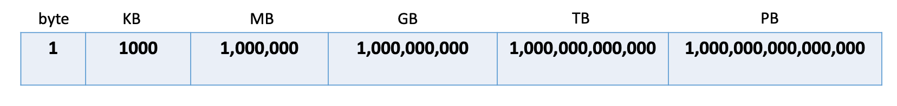

# system Design Made Simple
A guide on how to approach system design interviews with real world problems, solutions and a cheatsheet.

## Table of Contents
* [Prerequisite](#Prerequisite)
* [Examples with Solutions](#Examples)
* [How to approach](#How-to-Approach-SD-Interviews)
* [System Design Cheatsheets](./CHEAT-SHEETS.md)

## Prerequisite
Knowledge in large-scale & distributed systems components.
 
**If you're not familiar with one of these concepts**
(_scalability vs. performance, CAP theorem, 
back of the envelop estimation, cache, concurrency, 
distributed-computing, micro-services, communication-layer, application-layer, 
LB, reverse-proxies, relational-BDs, non-relational-DBS_) 

#### Review below materials before starting:
- [System Design Primer](https://github.com/donnemartin/system-design-primer)
- [DDI](https://www.amazon.com/gp/product/1449373321/ref=ppx_yo_dt_b_asin_title_o00_s00?ie=UTF8&psc=1)

## Examples
- [Design an Events Booker](./problems/EVENTS.md)
- [Design Auto suggestion](./problems/AUTO_SUGGESTION.md)
- [Design online code sharing platform](./problems/CODE-SHARE.md)
- [Design google Docs](./problems/GOOGLE-DOCS.md)

## How to Approach SD Interviews

In this section we'll discuss how to approach a system design interview with some examples on what to do in each stage.

## Description & Clarification Questions
The most important thing in any type of interview is to understand the problem.
This step is the most critical one which will define the path you're taking forward so give yourself sometime(enough time) to understand the requirements and the problem statement.

### Functional Vs. none functional requirements

Make sure to go over the description carefully and identify the following(write down a summary if you can)
- Functional requirements: main functionalities, type of contents, backend focused Vs. frontend focused, limitations, inputs and outputs
- None-functional requirements: availability Vs. consistency(CAP theorem), Latency, Randomness Vs. guessed etc...


## Back of the envelope estimation
- Number of users
- Read to write ratio
- Network bandwidth: write bandwidth (ingress), read bandwidth (egress)
- Storage
- 70% capacity model(your storage shouldn't exceed 70% of its capacity meaning always add 30% to your storage calculation)
- Cache storage follows 80:20 rule (20% of your data is accessed 80% of the time so your cache storage is ```20% * originalStorageCapacity```)
- What availability to aim at 9.999?

<br/>

**Useful Numbers**
```2.5 Million seconds in a month```
```3600 seconds in a hour```
```Availability of 9.999 is equal to 1 hour down time per year```
<p align="center">
  
  <br/>
</p>

**Latency numbers**

````
Latency Comparison Numbers
--------------------------
L1 cache reference                           0.5 ns
Branch mispredict                            5   ns
L2 cache reference                           7   ns                      14x L1 cache
Mutex lock/unlock                           25   ns
Main memory reference                      100   ns                      20x L2 cache, 200x L1 cache
Compress 1K bytes with Zippy            10,000   ns       10 us
Send 1 KB bytes over 1 Gbps network     10,000   ns       10 us
Read 4 KB randomly from SSD*           150,000   ns      150 us          ~1GB/sec SSD
Read 1 MB sequentially from memory     250,000   ns      250 us
Round trip within same datacenter      500,000   ns      500 us
Read 1 MB sequentially from SSD*     1,000,000   ns    1,000 us    1 ms  ~1GB/sec SSD, 4X memory
HDD seek                            10,000,000   ns   10,000 us   10 ms  20x datacenter roundtrip
Read 1 MB sequentially from 1 Gbps  10,000,000   ns   10,000 us   10 ms  40x memory, 10X SSD
Read 1 MB sequentially from HDD     30,000,000   ns   30,000 us   30 ms 120x memory, 30X SSD
Send packet CA->Netherlands->CA    150,000,000   ns  150,000 us  150 ms

Notes
-----
1 ns = 10^-9 seconds
1 us = 10^-6 seconds = 1,000 ns
1 ms = 10^-3 seconds = 1,000 us = 1,000,000 ns
````

[source](https://github.com/donnemartin/system-design-primer#availability-in-numbers)

## System interface definition
In this stage you should have acquired all necessary information to start implementing your main APIs.
Try to explain in details the type of contracts you're using and how the response will look like.
You can navigate back to your requirements summary to draw a better picture of your main APIs will look like.


**Request Example:**
````
postATweet(user-id, location, data, timestamp...);
generateUserPreferences(user-id, metadata, type, timestamp...);
readNewsFeed(user-id, keyword, type, timestamp...);
markFavorite(user-id, post-id, timestamp...);
searchAvailability(api-key, keyword, city, lat_long, radius, start_datetime, end_datetime, sorting_order...)
````
Specify parameters: String, int etc...

**Response Example**
````
json:

[
  {
    "EventID": 1,
    "ShowID": 1,
    "Title": "Carnaval",
    "Description": "Dancing Event",
    "Duration": 120,
    "Language": "English",
    "Date": "8th Oct. 2014",
    "Country": US,
    "StartTime": "14:00",
    "EndTime": "16:00",
    "Seats": 
    [
      {  
        "Type": "Regular"
        "Price": 9.99
        "Status: "Available"
      }
  }
 ]
````

## Defining data model
- Storage type: SQL vs NoSQL
- Database Design & relationships

<p align="center">
  
  <br/>
</p>

## High level Design
A rule of thumb when it comes to high level design is to draw 5 to 6 block and don't get stressed about it as you will scale horizontally across the way.

<p align="center">
  
  <br/>
</p>

## Detailed design
Dig deep in at least 1 or 2 components of your system.

## Identify bottlenecks and monitor your system
Criticize your design, add metrics, tracing and logging and predict outcome. Talk about failures and how you will address them
- DB optimization
- Caching
- Concurrency
- LB & proxies

Scale your system after identifying bottlenecks

## Be aware of your customers
Talk numbers and business metrics to showcase how you put your users first. Be data driven!

## Contributing

Contributions are welcome! If you have improvements or additions, please submit a pull request or open an issue.
