# system-design-examples
A set of examples on system design problems & most common SD questions.

## Table of Contents
* [Prerequisite](#Prerequisite)
* [Examples](#Examples)
* [System Design Cheatsheets](#System-Design-Cheatsheets)

## Prerequisite
Knowledge in large-scale & distributed systems components.
 
**If you're not familiar with one of these concepts**
(_scalability vs. performance, CAP theorem, 
back of the envelop estimation, cache, concurrency, 
distributed-computing, micro-services, communication-layer, application-layer, 
LB, reverse-proxies, relational-BDs, non-relational-DBS_) 

#### Review below materials before starting:
- [System Design Primer](https://github.com/donnemartin/system-design-primer)
- [DDI](https://www.amazon.com/gp/product/1449373321/ref=ppx_yo_dt_b_asin_title_o00_s00?ie=UTF8&psc=1)

## Examples
- [Facebook](./problems/FACEBOOK.md)
- [Twitter](./problems/TWITTER.md)
- [online code sharing platform](./problems/CODE-SHARE.md)
- [Instagram](./problems/INSTAGRAM.md)
- [Trip Advisor](./problems/TRIP-ADVISOR.md)
- [google Docs](./problems/GOOGLE-DOCS.md)
- [Netflix](./problems/NETFLIX.md)

## System Design Cheatsheets
<br/>

- Distributed system?

A system consists of multiple computers that communicate and interact with each other to achieve a certain goal

<br/>

- Advantages of distributed computing?
  - Zero latency
  - Infinite bandwidth
  - Secure network
  - Transport cost is near zero
  - One admin

<br/>

- Service discovery?

A system that can help services find each other, and keep track of registered names, addresses and ports.
e.g. Consul, Etcd, zoo-keeper etc...

<br/>

- Define UDP & give some common use cases?

User datagram protocol runs over IP and used to establish low latency & loss tolerating connections between applications.
It speeds up transmission by enabling the transfer of data before an agreement is established with the receiving party.
  * Use cases:
    * VOIP
    * DNS lookups
    * Video and audio playback

<br/>

- Define TCP & give some common use cases?

Transmission control protocol provides a reliable, ordered, error checked delivery of a stream of bytes.
Connections are established before data is sent which makes it slower than UDP however data loss is intolerant.
  - Use cases
    - SMTP
    - SSH
    - FTP
    - Telnet
    - HTTP

<br/>

- Differences between UDP & TCP?
<p align="center">
  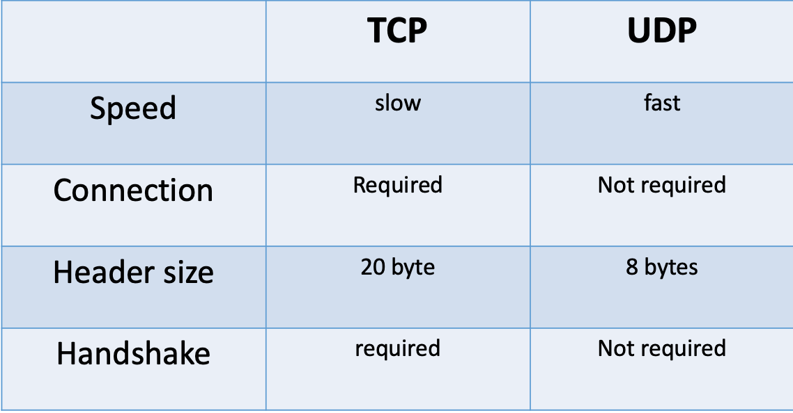
  <br/>
</p>

<br/>

- Define DNS?

Domain name service is a hierarchical system that primarily translates names into IP addresses

<br/>

- Types of scaling?

    1- Vertical scaling: adding more power/resources' interim of hardware (CPU, Disk, RAMs, SSDs etc...)

    2- Horizontal scaling: accept a ciel for hardware and get more servers with fewer capabilities

<br/>

- What is PACELC theorem ?

PACELC theorem states that if there's a partition a system can trade of between A(availability) and C(consistency).
E(else) the trade of is between C(consistency) & L(latency)

<p align="center">
  
  <br/>
</p>

<br/>

- Map the following DBs to their PACELC properties ?
  - Dynamo          ---------->         **PA | EL**
  - Mongo           ------------>       **PC | EC**
  - Bigtable        ---------->         **PA | EC**

<br/>

- What does data partitioning and data replication improves?

<p align="center">
  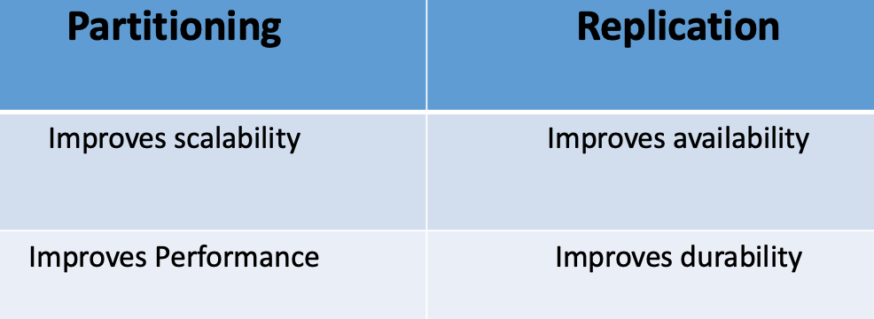
  <br/>
</p>

<br/>

- Data partitioning and distribution challenges? 
  
    1- Map specific node to what data it holds
    2- How to distribute data when adding or deleting a node

<br/>

- Suggest a solution to solve data partitioning challenges?

Use consistent hashing

<br/>

- How does consistent hashing works?

It maps data to physical nodes by using a ring and if a new node is introduced a minimal movement is required by accommodating the following rules:
    1- Hash range is in between (1-100)
    2- Ranges (100/number of nodes)
    3- Tokens are distributed across the ranges and represent data

<p align="center">
  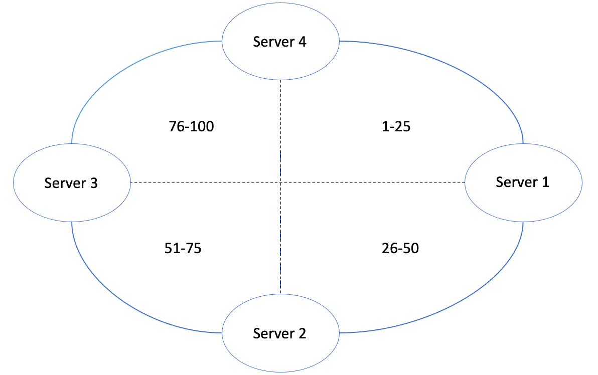
  <br/>
</p>

<br/>

- What's a hotspot in DB partitioning?

A server that's responsible for a huge partition of data that became a bottleneck after being hit with many requests

<br/>

- How does consistent hashing handles node addition ?

Make use of VNodes, virtual node that represents subrange in each physical node

- What are the properties of virtual nodes?
  - Assigned randomly so no two neighboring VNodes are assigned to the same physical node
  - Carry replicas for fault tolerance
  - Some servers might hold more VNodes than others

<br/>

- What's the problem of using round-robin to control LB lookups?
  - Servers may crash due to power users assigned to the same server
  - Cashing might also overload certain servers due to IP lookups for previous users

<br/>

- Problems that might be caused by LBs?

Session get lost

<br/>

- How to solve a session problem caused by LBs heuristic distribution of traffic ?

Use sticky sessions

<br/>

- Advantages of a VNode ?
  - Speedup re-balancing process
  - Improves availability by the usage of replicas
  - Decrease the possibility of having hotspots

<br/>

- What does RF (replication factor) represents in consistent hashing?

Number of data copies

<br/>

- Examples on DBs that uses consistent hashing?
  - Dynamo
  - Cassandra

<br/>

- Define AJAX polling?

A technique used by majority of AJAX apps where a client repeatedly polls (requests) a server and wait for a response; if the data is not available yet, the server sends an empty response

<br/>

- Disadvantages of AJAX polling?

Creates HTTP overhead because of the rate of multi empty responses

<br/>

- What's long polling (hanging GET)?

Uses the same technique as AJAX polling with the exception of server not responding in case of data not being available

<br/>

- In memory cache examples & characteristics?

Is a key/value store that lies on top of RAM (e.g. Memcache, Redis etc...)

<br/>

- When to use cache?

For read heavy duties

<br/>

- LB states ?
    - Active
    - Inactive

<br/>

- Define full-duplex communication?

A system that allows communications in both directions simultaneously e.g. telephone

<br/>

- What does websockets provide?

Provides full-duplex communication over a single TCP connection

<br/>

- The purpose of SSE (server-sent events)?

Under SSE clients can establish long term connection with a server where the server uses that to send data when it becomes available

<br/>

- The process of storing data files with id for easy access is called______?

Indexing

<br/>

- Give an example of a common way to handle access to indexed file system?

Bloom filters

<br/>

- Bloom filters?

A probabilistic data structure that tells you if an element MAYBE in a set or if it's definitely NOT. Space complexity: O(n)

If any bit is 0 ----> element doesn't exist
If all bits are 1 ----> element might exist

<br/>

- What ports to allow in the following scenarios?
  - From the outside to LB ----------> 443(https)
  - From LB to internal services ----> 443(https), 22(SSH), 989|990(FTPs)
  - From Services to DB -------------> 3306(default sql) etc...

<br/>

- What's SSL ?

Secure sockets layer, sets the standard for secure connection where it ensures data encryption on transfer. The updated version of SSL is called TLS(transport layer security)

<br/>

- How to ensure data replicas consistency when replicating data across multiple servers?

Quorum; is the minimum number of servers a system needs to successfully write the same data. The general rule of a thump is having (N/2)+1 which means an action must be taken on more than half of the available servers to mark the task completed.

<br/>

- How to detect availability across different servers?

Heartbeat; heartbeat is a concept used to describe the process of sending periodic signals between different servers to ensure availability

<br/>

- What are the ports of the following protocols?
  - FTP -------> 20 | 21
  - SSH -------> 22
  - Telnet ----> 23
  - SMTP ------> 25
  - DNS -------> 53
  - HTTP ------> 80
  - HTTPS -----> 443
  - FTPS ------> 989 | 990

<br/>

- Sessions in a system behind LB should be stored in ________ or ________ ?
  - centralized data store or external cache

<br/>

- Give an example of a tool used to keep code consistency across all servers?
  - aws AMI

<br/>

- Data caching patterns ?
  - Cached DB queries "db cache"
  - Cached Objects "application cache"

<br/>

- Types of caching?
  - Client cache (browser | OS)
  - CDN caching 
  - Web server caching (reverse proxy caching static contents)
  - DB caching
  - Application caching (memcache | redis)

<br/>

- How to avoid corrupted data transfer in a distributed system?

Calculate checksum and store it with the data

<br/>

- How could a program know what it was doing before a system crash ?

To guarantee data integrity each modification can be first written to WAL(write ahead log) which should contain enough info to redo or undo the transaction

<br/>

- Give an example on WAL real world use case?
  - Cassandra
  - Kafka

- Define Log segmentation?

The process of breaking logs into multiple files, so it improves performance; controlled by rolling policy (time based)

<br/>

- How do systems like Kafka ensures data integrity and consistency ?

By the use of Quorum and High-watermark; high-watermark is the highest index which has been replicated across all replicas(followers)

<p align="center">
  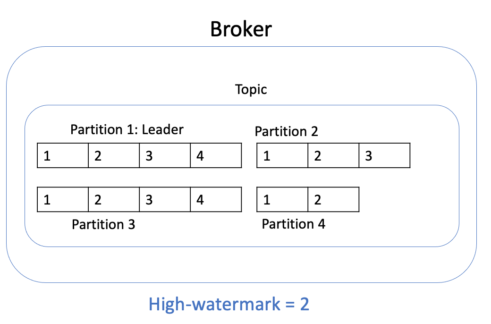
  <br/>
</p>

- What's a cronjob?

Time-based job scheduler that runs periodically

<br/>

- Asynchronism paradigms? 
  - Doing time-consuming tasks in advance when predictable e.g. turning dynamic contents into html
  - Asynchronous runs when a task isn't predictable

<br/>

- Scalability Vs. Performance ?
    - If you have a performance issue; your system is slow for one user
    - If you have a scalability issue; your system is fast for one user and slow under pressure

<br/>

- Latency Vs. throughput?
  - Latency is the time to perform a task
  - throughput is the number of action per time unit

Aim for maximal throughput and acceptable latency

<br/>

- CAP theorem?

In distributed systems; you can have only 2 of the following properties (partition tolerance and consistency | partition tolerance and availability)

<br/>

- Define consistency?

Every read receives the latest write

<br/>

- Define Availability ?

Every request receives a response without a guarantee it contains the most recent information

<br/>

- Define Partition tolerance ?

The system continues to operate despite a network failure

<br/>

- CP is a good choice when a system requires ________?

Atomic reads and writes

<br/>

- AP is a good choice when a system requires ________?

Work continuity despite errors

<br/>

- What are consistency patterns?
  - Weak consistency: after a write; read might or might not see it (e.g. VOIP)
  - Eventual consistency: after a write; read will eventually sees it (e.g. DNS, emails)
  - Strong consistency: after a write; read will see it (e.g. RDBMS, file system)

<br/>

- Availability patterns?
  - Failover (active-passive | active-active)
  - replication (leader-leader | leader-follower)

<br/>

- Downside of failover approach?
  - Adds more hardware
  - Introduces complexity
  - Potential of data loss

<br/>

- How to measure availability ?
  - In sequence: availability(foo) * availability(bar)
  - In parallel: 1-(1-availability(foo) * 1-availability(bar))

<br/>

- What's a none-repeatable read in Kafka like systems?

A read that occurs when a subscriber reads the same message twice but gets different results

<br/>

- How to handle a none-repeatable read ?

Use high-watermark

<br/>

- Primary key, partition key and column key in Cassandra?
  - primary key can contain a partition key and 0 or more column keys
  - partition key is used to determine which node to look into for specific data
  - column key is to determine a clustering column

<br/>

- Base 64 encoding?

8-bit bytes group of binary to text encoding to represent binary data

<p align="center">
  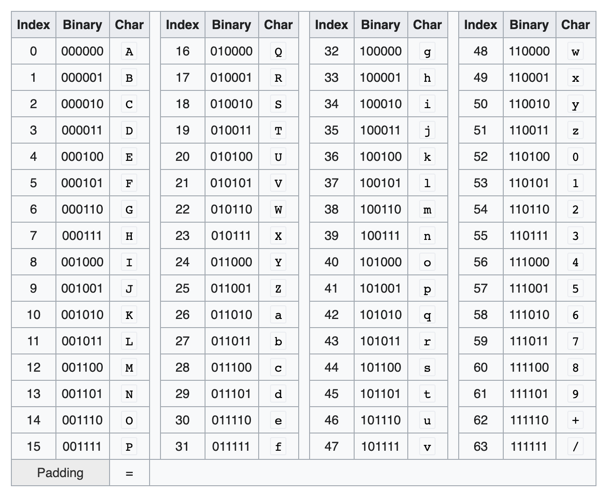
  <br/>
</p>

[source](https://en.wikipedia.org/wiki/Base64)

<br/>

- Types of DNS records?
  - Ns record (name server - specifies DNS server for your domain/subdomain)
  - Mx record (mail exchange - specifies mail servers for accepting messages)
  - A record  (address - points a name to IP)
  - CNAME record (points a name to another)

<br/>

- Example on services that provides managed DNS services?
  - route 53
  - cloud flare

<br/>

- Methods of routing traffic though DNS?
  - weighted round-robin
  - latency based
  - geolocation based

<br/>

- Disadvantages of DNS?
  - introduces a slight delay
  - exposed to ddos attacks
  - hard to manage

<br/>

- Define gossip protocol and how cassandra uses it?

A peer to peer protocol in which nodes share state information about themselves to detect failures (done randomly every second)

<br/>

- Components of a gossip message?
  - generation number incremented every time a node restarted
  - seed nodes; only used to bootstrap gossip process for new nodes

<br/>

- Phi-accrual failure detector?

An algorithm that uses historical heartbeat information in cassandra to detect nodes failure and set accurate heartbeat time

<br/>

- Cassandra write path?
  - each write is appended to a commit log(WAL) stored on disk
  - then written to MemTable in memory
  - then periodically flushed to SSTable on disk
  - periodic compaction runs to merge SSTable for faster access

<p align="center">
  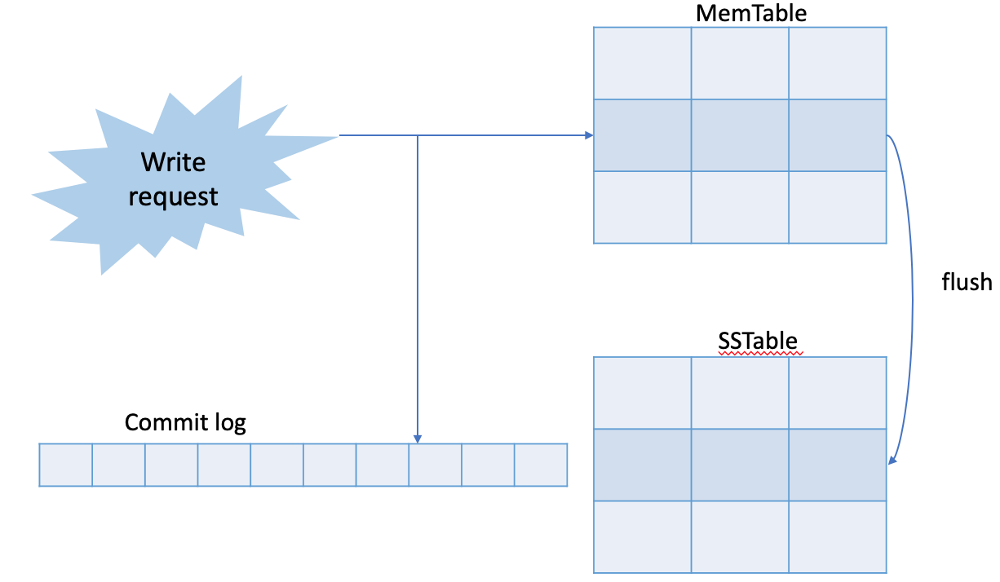
  <br/>
</p>

<br/>

- CDNs ?

A globally distributed content delivery network, used to serve contents from location closer to the user

<br/>

- Types of CDNs?
  - push CDNs: works well with contents that are rarely updated; receives updates whenever published(less traffic scenarios)
  - pull CDNs: cached contents client side with TTL (heavy traffic scenarios)

<br/>

- Examples on CDNs providers?
  - Akamai
  - Amazon cloud-front

<br/>

- NAT ?

Network address translation; maps an IP address to another while they are in transit

<br/>

- Forms of caching cassandra?
  - row cache: caches read (hot rows)
  - key cache: stores a map of recent reads partition keys (less memory than row cache)
  - chunk cache: stores uncompressed chunks of data

<br/>

- SSTable in cassandra is ______ storage?
  - immutable

<br/>

- Types of files on SSTables ?
  - data files (actual data)
  - partition index files (partition keys to byte offset)

<br/>

- Tombstones in Cassandra?

A concept similar to soft delete where data isn't deleted directly rather given an expiry date (usually 10 days)

- Ways to implement LBs?
  - hardware (expensive)
  - software (HaProxy)
  
<br/>

- Ways to route traffic via LB?
  - random
  - least loaded
  - wighted round-robin
  - layer 4 (looks into transport layer to determine distribution -performs NAT-)
  - layer 7 (looks into application layer to determine distribution - involves headers - usually used for videos and payments)

<br/>

- Examples on LBs?
  - NGINX (EDI based - layer 4 & 7 supported)
  - HAProxy (simple LB with cookie insertion)
  - Elastic LB (layer 4 & 7 support)

<br/>

- How Does a DB like Cassandra scale?

Adding more nodes and replicas by the use of consistent hashing and VNodes

<br/>

- How does Cassandra ensure strong consistency?

R(read replicas) + W(write replicas) > RF(replication factor)

<br/>

- How are bloom filters are used in Cassandra?

Read and check if a requested record exists in SSTable

<br/>

- Define a messaging system e.g. kafka ?

A system responsible for transferring data among services; decoupling different parts of a distributed system

<br/>

- Ways to handle messages in a messaging system?
  - queues (each consumer consumes a unique message in sequence)
  - publisher-subscriber (multiple consumers can consume the same message)


<p align="center">
  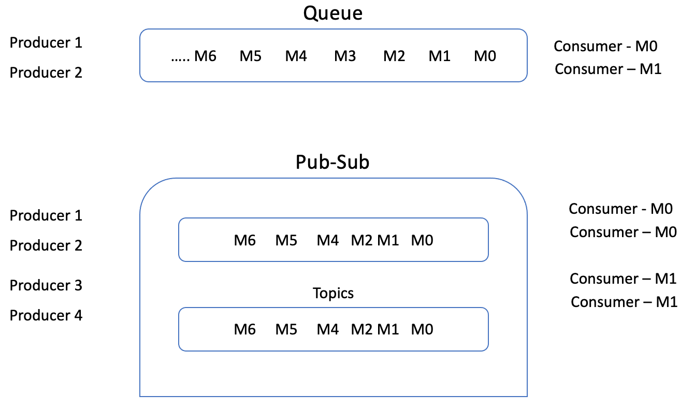
  <br/>
</p>

<br/>

- Protocols supported by elastic LB?
  - HTTP
  - HTTPs
  - TCP
  - SSL

<br/>

- What defines a model framework for implementing a standard format for communication?

OSI (open system interaction)
<p align="center">
  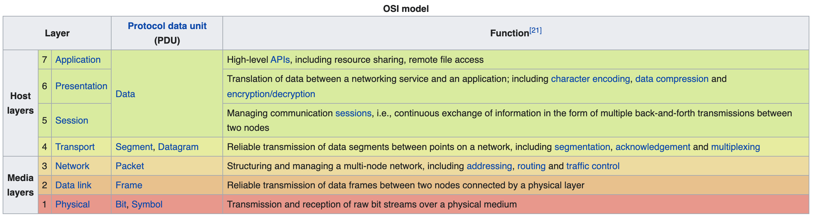
  <br/>
</p>

<br/>

- What's a reverse proxy?

Is a web server that centralized internal services and provides a unified interface for the public

<br/>

- Benefits of a reverse proxy?
  - increases security (block and whitelist IPs)
  - increases scalability
  - SSL termination can be the responsibility of a reverse proxy
  - caching and serving static contents

<br/>

- Differences between reverse proxy and LB
  - LBs are useful to route traffic to multiple servers for fair distribution and failure tolerance 
  - RPs are useful to satisfy a certain request by directing it to the appropriate server

<br/>

- Uses of Kafka?
  - streaming real time data
  - message transfer between different entities 
  - storing huge amount of data

<br/>

- Real use cases of Kafka like systems?
  - Metrics
  - Stream processing
  - Commit log
  - Activities tracking

<br/>

- Kafka components/concepts?
  - brokers (servers responsible for storing data)
  - records (a message or event that contains timestamp, key, value and metadata)
  - topics (categories for messages can be thought of as tables in RDBs - logical grouping of messages)
  
<br/>

- ACID properties - relational DB?
  - Atomicity: each transaction is all or nothing
  - Consistency: reads gets latest writes
  - Isolation: executing the transaction concurrently yields the same result as executing it in parallel
  - Durability: once a transaction is committed, it will remain so

<br/>

- Zoo-keeper main job in Kafka?

a coordinator for message brokers, that maintains offset, manage access control and track partitions
<p align="center">
  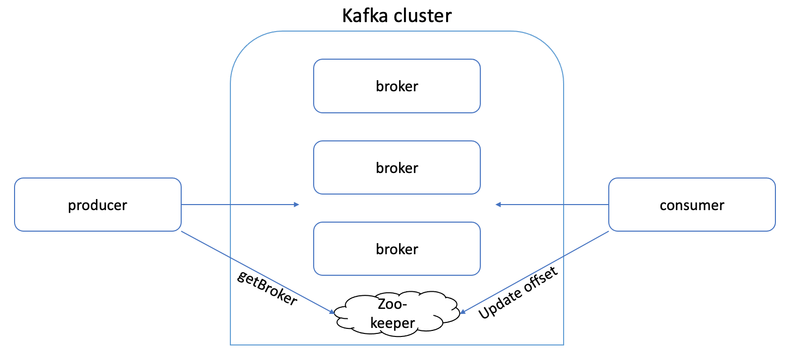
  <br/>
</p>

<br/>

- To locate a specific message Kafka needs?
  - topic
  - partition
  - offset number

<br/>

- How does a producer in Kafka controls which partition a message is placed in?

It sends a key with message, otherwise round-robin is applied to handle distribution

<br/>

- Can consumers in Kafka read messages from any offset they choose?

Yes. [Dumb broker/smart consumer](https://medium.com/@vsingla160/kafka-vs-rabbitmq-a50933fec419)

<br/>

- How does Kafka handle a single point of failure in partitions?
Leader/Follower, each partition has one or more kafka broker acting as a leader

<br/>

- What property should a broker in Kafka poses to be allowed as a leader?
ISR(in sync replica); a broker that has the latest data

<br/>

- Techniques to scale a relational DB?
  - Leader-Follower replicas
  - Leader-Leader replicas
  - Federation: functional partitioning - splits DBs based on function
  - Sharding: splits data across different DBs
  - Denormlization: the process of replicating data to avoid expensive joins
  - SQL tuning: benchmarking and profiling to identify bottlenecks

<br/>

- How can benchmarking and profiling help you to scale DB?
  - Tighten the schema (usage of static types instead of dynamic e.g. CHAR instead of VARCHAR)
  - Better indexing
  - Avoid expensive joins
  - Partition tables

<br/>

- Types of NoSQL DBs?
  - key-value store
  - document store
  - wide column store
  - graph store

<br/>

- Properties of NoSQL DBs BASE?
  - Basically available
  - Soft state: the state of the system may change over time
  - Eventual consistency

<br/>

- STW GC?

Stop the world GC(garbage collector) happens when a region of memory is full and GC pause trying to reclaim it

<br/>

- In what order are key-value store?

Alphabetic order - lexicographic

<br/>

- DDL and DML stands for?
  - data definition language - create statement
  - data manipulation language - update statement

<br/>

- Document store?

A store centered around documents, provides an API designed to work with occasionally changing data. e.g. mongoDB & dynamoDB

<br/>

- Examples on key-value stores?
  - Redis
  - Memcache

<br/>

- Wide column store?
A nested map of data that's highly available and scalable. e.g. Cassandra & BigTable

<p align="center">
  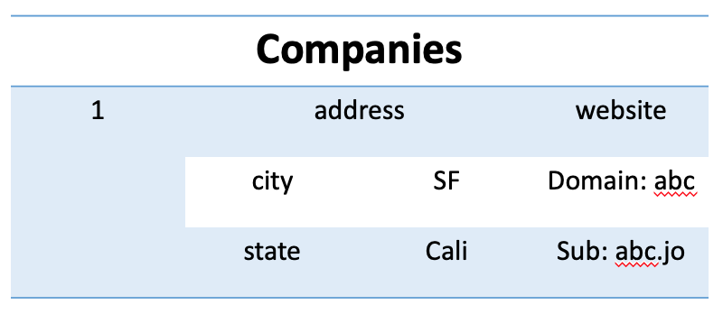
  <br/>
</p>

<br/>

- Graph DB?

A store represented by nodes and edges where nodes are records and edges are the relationship between them. e.g. Neo4j

<p align="center">
  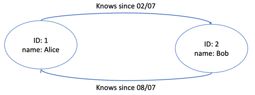
  <br/>
</p>

<br/>

- Zombie controller in Kafka and split brain issue?

A zombie controller is a node that has been deemed out of service and then came back alive. This might cause two nodes marked as controllers which is known as split brain.

<br/>

- How does Kafka address the split brain issue?

By using generation clock, an epoch number that represents current controller uptime

<br/>

- Producer options in Kafka for write responses?
  - Async: no response required
  - Committed to leader
  - Quorum

<br/>

- Consumer options to read a message from Kafka?
  - Exactly once
  - At least once
  - At most once

<br/>

- Does Kafka write messages on RAM?

no, all kafka messages are kept on disk

<br/>

- What type of DB to prefer when you are dealing with a semi-structured dataset?

NoSQL DBs

<br/>

- What does Redis offer aside from in-memory key-value store?
  - Persistence option
  - Support for more complicated data structures like lists and sets

<br/>

- Retention policy in Kafka?

Unless explicitly stated; the record is kept till the system is out of storage

<br/>

- How does Kafka ensures durability?
  - replicas (leader/follower)
  - messages are stored on disk

<br/>

- How does kafka manages throughput?

By using consumer groups where consumers can be parallelized

<br/>

- DB query caching approach?

Hash the query and use it as a key for your result

<br/>

- Query caching disadvantages?
  - Hard to delete cached results with complex queries
  - If table structure is changed; you need to delete your cache

<br/>

- Object cache examples?
  - User session
  - Rendered web pages
  - Activity stream
  - User graph data

<br/>

- Cache update strategies?
  - cache a side (memcache)
  - write through
  - write behind
  - refresh through

<br/>

- Disadvantages of cache?
  - Need to maintain consistency between source and cache
  - Need to make application changes

<br/>

- While configuring a dashboard what things you should focus on?
  - Logging: errors rate and debugging purposes
  - Metrics: application (CPU usage, network traffic, threads threshold) and business metrics(checkout and loyalty rate)
  - Traces: performance and delays

<br/>

- EKS?

Elastic Kubernetes services, a managed container service to run and scale kubernetes instances

<br/>

- In JMX a monitoring is done by?

Querying data from managed beans to monitor performance

<br/>

- Page cache?

Transparent cache for the pages originating from secondary storage (OS keeps them in unused part of RAM)

<br/>

- Zero copies?

A computer operation in which CPU doesn't perform unnecessary copying of data

<br/>

- Examples on message queues?
  - Redis
  - Rabbit MQ
  - SQS
  - Kafka

<br/>

- Give an example of a well known issue with msg queues and how to solve it?

Back pressure, when a queue starts to grow significantly resulting cache misses and slow performance. Solved by [exponential backoff](https://en.wikipedia.org/wiki/Exponential_backoff)

<br/>

- HTTP methods?
  - GET (read a resource)
  - POST (creates a resource)
  - PUT (creates or replace a resource)
  - DELETE (delete a resource)
  - PATCH (partially update a resource)

<br/>

- An HTTP method is idempotent if?

An identical request can be made once or several times in a row with the same effect while leaving the server in the same state

<br/>

- Communication protocols and mechanisms in a distributed system?
  - RPC (remote procedure call)
  - REST (representational state transfer)

<br/> 

- What's RPC?

A communication protocol in which a client causes a procedure to execute on a different service as if it were local
e.g. protobuf, avro etc...
<p align="center">
  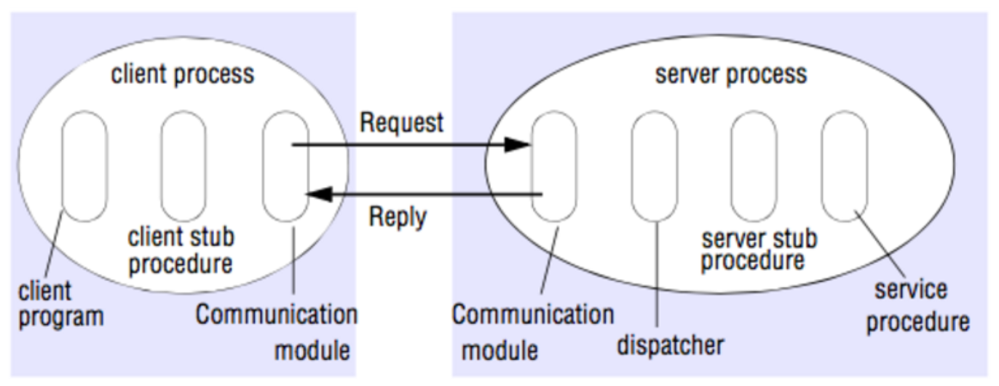
  <br/>
</p>

[source](https://tianpan.co/notes/2016-02-13-crack-the-system-design-interview)

<br/>

- Advantages and disadvantages of RCP?
  - improved performance (everything encoded as binary over http2 unlike string in 1.1)
  - language agnostic e.g. protobuf
  - client becomes tightly coupled with the server implementation
  - hard to debug

<br/>

- All communication in REST must be?

cacheable and stateless

<br/>

- Qualities of a REST api?
  - self descriptive
  - fully accessible by a browser
  - identify resources -uses the same URI regardless of the operation-

<br/>

- Disadvantages of REST?
  - hard to manage when modification happens
  - multiple trips for hierarchical data

<br/>

- Patch, event driven and request|response systems?
  - request|response: synchronous system where a client sends a request and a server reply by a response
  - patch: asynchronous system where packets are delivered regardless of you requesting it or not
  - event-driven: asynchronous system where a worker will wait for an event to be published to take an action

<br/>

- SOLID principles?
  - single responsibility
  - open-closed
  - liskov substitution
  - interface segregation
  - dependency inversion

<br/>

- Tools to capture heap-dump and thread-dump in java?
  - JConsole
  - JMeter

<br/>

- Closures?

A technique to implement first class functions; a functional call where you pass a function to another

<br/>

- Types of application deployment?
  - Blue-green deployment: you have 2 instances of your application where the green is live and the blue instance is the new setup you want to switch to
  - Canary deployment: used to release features in patches
  - Atomic deployment: using a single instance to perform deployment then change directories when an instance is done
  - Shadow deployment: a shadow deployment strategy is one where the new version is available alongside the old version in prediction, but a copy or forked version of traffic to the older version is sent to the new version for production testing
  - A/B testing deployment: strategy relies on real-world statistical data to decide on a rollout or rollback.

<p align="center">
  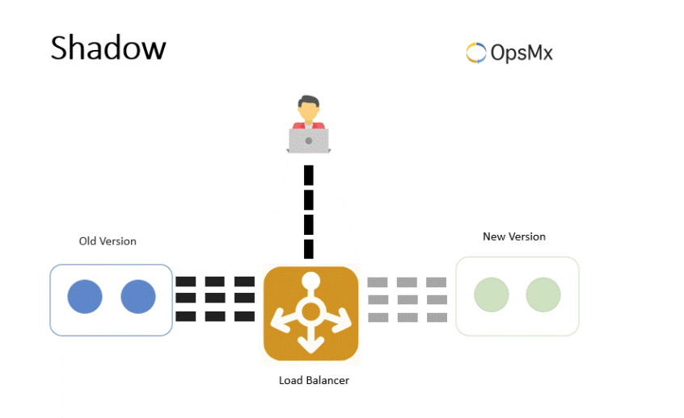
  <br/>
</p>

<p align="center">
  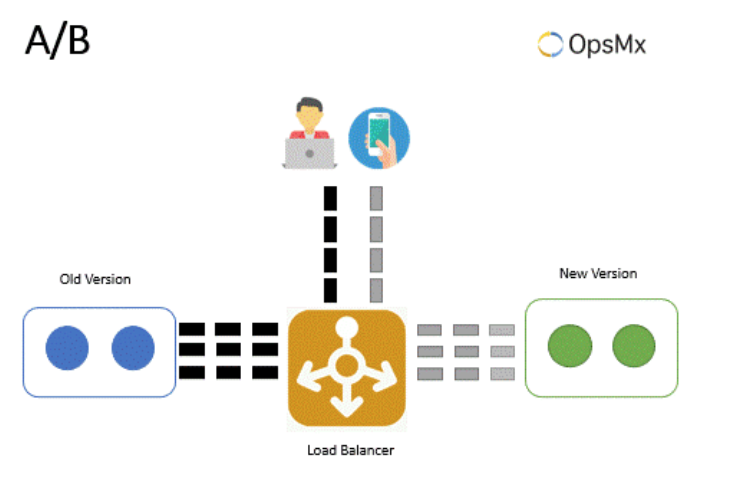
  <br/>
</p>

[source](https://www.opsmx.com/blog/advanced-deployment-strategies-devops-methodology/)

<br/>

- Map reduce?

A model to process vast amount of data (multi-terabytes) in parallel on large clusters e.g. hadoop

<p align="center">
  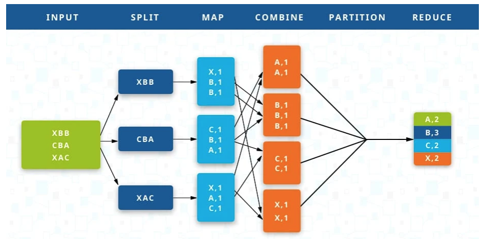
  <br/>
</p>

[source](https://www.talend.com/resources/what-is-mapreduce/)

- Schema registry in Kafka?

Handles schema distribution between consumer and producer

<p align="center">
  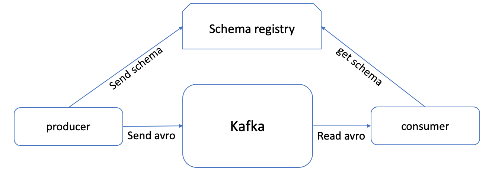
  <br/>
</p>

<br/>

- Differences between a process and a thread?
  - process: an executing instance that provide everything to execute a program (address space, open handle to files and environment variables)
  - thread: is a subset of a process that executes task independently (the smallest execution unit)
  
<br/>

- Forking Vs. threading?
  - forking: creates a new process that copies old process and can run another part of the program
  - threading: uses multiple threads to execute different parts of the program

<br/>

- Reactive programming principles?
  - Asynchronous
  - None-blocking
  - Functional support
  - Backpressure

<br/>

- Concurrency common problems?
  - Race condition: when 2 threads access the same data and try to change it where the result becomes dependent on who gets the resource first
  - Starvation: when a thread cannot access a certain resource as a result of another thread acquiring it
  - Dead-locks: where 2 or more threads are blocked waiting for each other

<br/>

- Ways to prevent concurrency issues?
  - locking
  - freeing up resources
  - async blocks

<br/>

- Service mesh?

A communication infrastructure for services to communicate (consumer, provider and orchestrator: provides rules for proxies on how to behave)

<br/>

- Database per service patter - Saga?

A sequence of local where if one fails saga executes a rollback to prevent impact

<br/>

- APIs?

Contacts to exchange data

<br/>

- How to make sure your distributed cache stays consistent?
  - Use a central cache system e.g. redis
  - Add a well-defined TTL
  - Use resource version keeper

<br/>

- When integrating a third party API what design pattern that first comes to your mind?

Circuit breaker pattern

<br/>

- In Cassandra, you model your data for____?

Reads, design around queries rather than writing your queries around your data model

<br/>
- GRPC?

Language Agnostic API based on RPC, uses proto buffers which facilitate http2(data as binary)

<br/>

- Example.proto

```
syntax = "proto3";

message Ping{
String name=1;
}

message PingRequest{
Ping ping = 1;
}

message PingResponse{
String result=1;
}

service PingService{
rpc ping(PingRequest){
return PingResponse;
}
}
```

<br/>

- Differences between protobuf and json?
  - json encoded as a string
  - protobuf encoded as binary

<br/>

- Blob storage?

A binary storage e.g. S3

<br/>

- L1 Vs. L2 caching?
  - L1: smaller memory capacity, faster access and no need to refresh (SRAM)
  - L2: accessed after L1 is searched, slower, need to be refreshed (DRAM)

<br/> 

- Inheritance Vs. Composition?
  - Inheritance: designing around what the objects are
  - Composition: designing around actions

<br/>

- Mechanisms to free up (evict) cache?
  - LRU (least recently used)
  - LFU (least frequently used)

<br/>

- How to calculate TTL?
  - Historical data
  - Use cases
  - Monitor hit, miss and stale data ratio

<br/>

- Kafka APIs?
  - Admin api
  - Producer api
  - Consumer api
  - Kafka streams api
  - Connect api

<br/>

- Circuit-breaker pattern?
  - detect something is wrong
  - take temporary steps to avoid worsening the situation
  - deactivate problematic component

<br/>

- Circuit-breaker parameters?
  - number of retries
  - threshold(how many failures before breaking the circuit)
  - timeout
  - how long to wait for to trigger a retry


<br/>
- Java concurrency synchronizers?
