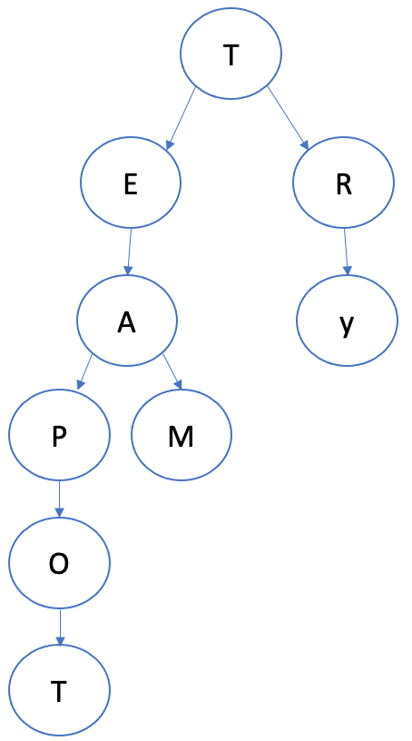

# Design Auto-Suggestion Service
Design realtime suggestion service which recommends suggestions to users as they enter test in search bar.

## Description
Our service will predict the searched terms based on the characters the user enters in real-time and give a list of suggestions 
to complete the query.

## Functional Requirements
- For simplicity our suggestions are case-insensitive
- Suggest top 5 terms starting with whatever the user has typed
- There must be a ranking system in which a suggestion get some sort of ranking to appear as a top term

## None-Functional Requirements
- Our system should be highly available with minimal latency
- The suggestion must be retrieved in real-time with a maximum delay of 300MS

## Clarification Questions & discussion
**Can we depend on a database to store our suggestions and make it available at real time with that type of delay?**
Apparently, a database storage as a first layer storage won't be an option in our case as we need to store our suggestions in memory for fast access

**What type of storage would work best for such a scenario?**
A trie data structure is the first thing that comes to mind as we have to process a huge amount of possibilities in a very short period of time (vertex: represent a character, Level: represents frequency).
A trie is a tree like data structure used to store phrases where each vertex stores a letter of a word in a sequential manner.

<br/>

<p align="center">
  
  <br/>
</p>

**Can we store top suggestions with each vertex?**
Storing a frequency rate will definitely help in terms of the performance, but it will require a lot of storage as we have to store many term in a trie where it could grow down exponentially.
Instead, we can store top 5 terms as this was one of the requirements to show only top 5.

**How to Update our trie?**
Assuming we have 100K searches per second.
If we try to update our trie for every search it will hamper up our resources and effect performance. 
One solution to handle this could be to update our trie offline.

As the new searches come in we can log them and also track their respective frequencies.

Then we can set up a Map Reduce to process all the logging data periodically. 
These Map Reduce jobs will calculate frequencies of all searched terms in the period of time then update our trie with new data.

**When updating frequencies for a term should we consider the timeline?**
Yes, when updating frequency we should consider that this top term is only highly frequent in this period of time. 
So we can set up a time to live for each frequency and reset it as required whenever needed.

**While ranking should we consider other factors beyond time and number of queries?**
We can consider geolocation and user preferences

## Back of the envelope estimation
If we are expecting 100K searches per second, we have ~2.5 million seconds in a month which would yield 100k * 2.5M = 250Billion searches per month.
If on average each search would consist of 2 words 5 bytes per each we would have 10 bytes. 
The required storage in monthly bases would 250Billion * 10 bytes = 2.5 TB.
If we apply 70% capacity model where we shouldn't use more than 70% of our storage limit then we would need almost ~ 3 TB/month.

## System interface definition
searchQuery(sequenceOfChars, userId, location, type)

## Defining data model
- Permanent file storage to store our trie for top suggestions e.g. S3

## Identifying bottlenecks
One of the main Concerns is serving our data from a file system where the data isn't partitioned for easier access. 
We also need to think about how we can improve the response time of our system; according to 80:20 rule most of the time only 20% of the data are frequently accessed 80% of the time.
One more thing to consider is the availability of our system since it relies on one server only, this may cause data loss and availability issues whenever the threshold is exceeded.  


## Improve your already existing system
- Our Trie will also sit in memory to serve top suggestions, we can use a Redis implementation for this purpose and LFU mechanism to evict our in memory cache, with a storage of 20% of our original data store, redis can serve data efficiently for 80% of the incoming requests.
- Partition, we can enhance the performance of a lookup in our file storage by range partitioning where we partition data based on the first letter of the word ```[[Add, App]][[Bad,Bride]]```
- Data loss potential can be addressed by using replicas
- We can increase the availability of our system by using LB(load balancer) and scale horizontally adding more webservers to host our services but keep in mind that our LB should keep track of our partitioning scheme to be able to redirect the user to the correct partition

## Effect on customer and business (How can you improve the service for your current customers)
- Availability and performance dashboards: add dashboards to support tracing and monitoring of your current system components -delay, latency, cpu usage, components communication- and take action based on the results
- Business dashboards: define dashboards to support business metrics on how many users went back to your service, what they find useful or not, type of interactions when a geo-based filter is used to fitch suggestions vs. geo Agnostic ranking mechanism
- More improvements based on above results (Add CDN support, block sending request on each character -wait for a short amount of time if a user still typing-)

