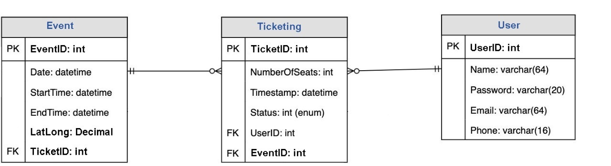
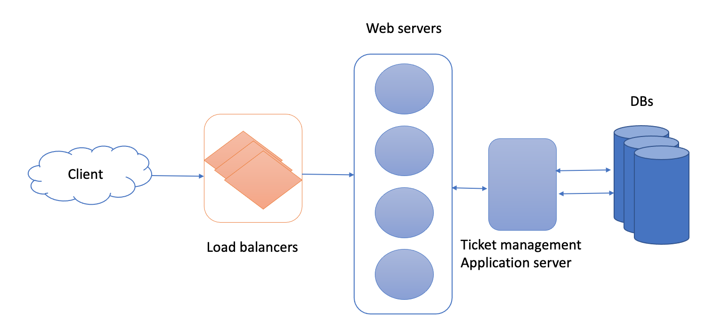

# Events
A website that enables you to book a ticket to your favorite event

## Description
Our system will enable users to purchase a ticket for a live event anytime, anywhere.

## Functional Requirements
- Our booking service should be able to list different locations where an event is organized
- User selects a location, the service should display the events organized in that specific location
- Once the user selects an event, the service should display the exact place and time for the event
- The user should be able to choose a show at a particular event
- The service should be able to show the user the entrance arrangement and the user should be able to select multiple entrance tickets according to their preference (economy, regular, VIP).
- The user should be able to distinguish available tickets from booked ones
- Users should be able to put a tag on the ticket for 10 minutes before they make a payment to finalize the booking
- The user should be able to wait if there is a chance that the ticket might become available(when tagged by other users expire)
- Waiting customers should be serviced in a fair, first come, first served manner

## None-Functional Requirements
- The system would need to be parallelized. There will be multiple requests for the same ticket at anytime, and it should be handled fairly.
- The system should be secure and the database ACID compliant as we're handling financial transactions

## Clarification Questions & discussion
**Can we assume that the service doesn't require any user authentication?**
Yes, for simplicity you can assume that

**Will the system handle partial tickets being sold as some got unavailable at some point?**
The system should handle that by either selling all or not completing the transaction

**Can we assume that some events may draw lots of attention which will cause heavy pressure upon the system?**
Yes, there will be some event that has been waited for a long time, and you will notice high spike in demand. Our system should be highly available and scalable.

**Is there a limit to how much a user can book not to abuse the system?**
Yes, a user should be restricted not to buy more than 10 tickets per show


## Back of the envelope estimation
**How many user views do we have per second?**
Lets assume that we have 10K page views per second from which 1 booking occurs.

From that we can conclude that our read:write ratio is 10000:1. 
So our egress(reads|views) will be ```10k*2.5M(seconds per month) ~= 25Billiton requests/month```.
Ingress assuming we have each write holding (10 KB - including userData, showData, ticketsData etc...) worth of data ```1 * 10K * 2.5M ~= 25GB``` storage per month.

Now Applying 70% capacity rule where we should not exceed 70% of our storage capacity we can assume that it's safe to add ~=```30GB``` storage capacity per month.

Cache, it's important to also calculate how much cache storage we need, having 80:20(20% of data is used 80% of time) it's safe to assume that our cache storage won't exceed 20% of ```30GB``` = ```600MB```.

## System APIs
We can use a REST API to expose the functionalities of our system, here we will use two main APIs:

- View Events (our view event API will be responsible for searching for a certain event/events based on ```name(keyword), location, userPrefernces and type```)
```
searchEvents(api_key, user_id, keyword, lat_long, radius, start_time, end_time, 
type, userPreferences)
------------------------------
- api_key(String): auth param
- user_id(String): to throttle user based on number of bookings
- lat_long(number)
- radios(number)
- start_time(String)
- end_time(String)
- type(String)
- user_preference(array[Strings])
```
- Book Tickets (our booking API will be responsible for booking a set of one or more tickets for one or more events for a certain user)
```
reserveTickets(api_key, userId, List<Tickets>, eventId)
```
- Response

```json
[
  {
    "EventID": 1,
    "Title": "Carnival",
    "Description": "Dancing event",
    "Duration": 240,
    "Language": "English",
    "ReleaseDate": "8th Oct. 2021",
    "Country": "USA",
    "StartTime": "14:00",
    "EndTime": "16:00",
    "Seats": [
      {
        "Type": "VIP",
        "Price": 99.99,
        "status": "Available"
      },
      {
        "Type": "Regular",
        "Price": 19.99,
        "Status": "Available"
      }
    ]
  }
]
```

## Defining Data Model
- Each event has multiple tickets
- Each user can book multiple tickets
- Each event has one location

<p align="center">
  
  <br/>
</p>

## High Level Design

<p align="center">
  
  <br/>
</p>

## Deep dive into components of our main features in our main service (Booking Management)
- Implement a queue in DB to track holding list
- Implement Long polling to share with the user when their seat is available
- Kafka to handle our long polling for consumers and trigger real time events

## Identify bottlenecks & Scale
Criticize your system
- Build a dashboard to collect application metrics
- Enable tracing to identify performance bottlenecks
- Logging for error rates and debugging

As we dive in into the data we collected above, we can see some performance issue related to:
- slow reads -> (cache to serve events views and handle user sessions and CDN to handle static resources)
- slow response(confirmation) upon writes -> (partitioning of our db & asynchronous writes to our queue)
- one point of failure -> replicas and multiple webservers to serve application layer with LBs & proxies to coordinate traffic


## User impact 
Finally, it's a good thing to bring up a customer first type of thinking by sharing how you can improve customer experience, customer loyalty rate and add metrics to measure business impact.
